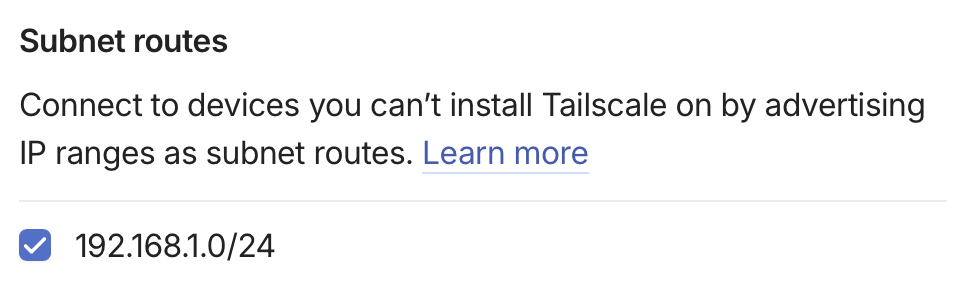
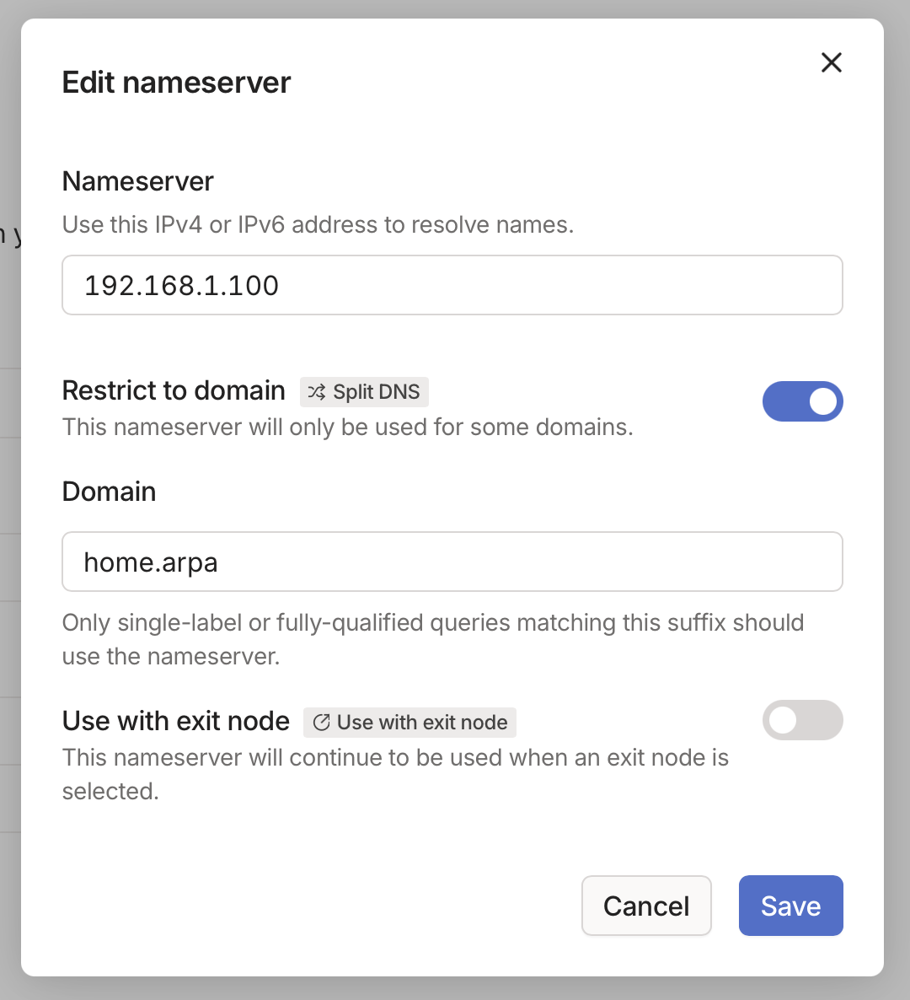

I run several services on a Synology NAS at home. My original setup used `.local` hostnames and port numbers, with addresses like `http://nas.local:8000`. It worked on my home network, but I could never remember which port belonged to which service.

Away from home it was worse. I could connect to my network through Tailscale, but the `.local` hostnames stopped working because mDNS doesn't cross the tunnel. I had to use the NAS's IP address instead, assuming I could remember that and the port number.

I wanted an address like `bookmarks.home.arpa` to work both at home and over Tailscale, with nothing exposed to the internet. The setup uses Pi-hole for DNS, Synology's reverse proxy for routing, and Tailscale for remote access.

## Local DNS

`.local` was the first problem. It is reserved for mDNS, which is useful for discovering devices on a local network but not for names that need to work across a VPN.

I chose `home.arpa` instead. It is [reserved for home networks](https://datatracker.ietf.org/doc/html/rfc8375), so it won't conflict with a real domain or send queries out to public DNS servers.

I already run [Pi-hole](https://pi-hole.net) for ad blocking. Since all my services currently live on the same NAS, I added a wildcard rule that sends every `home.arpa` name to its LAN address:

```ini
local=/home.arpa/
address=/home.arpa/192.168.1.100 # NAS IP address
```

The `local` line stops queries for `home.arpa` being forwarded upstream. The `address` line maps every name beneath it to the NAS.

Pi-hole v6 does not load files from `/etc/dnsmasq.d` by default. I enabled **Load additional dnsmasq configs from `/etc/dnsmasq.d`** under **Settings → All settings → Miscellaneous**.

My router also hands out the Pi-hole address as its DNS server through DHCP. After restarting Pi-hole, names such as `bookmarks.home.arpa` resolved to the NAS from any device on the LAN.

## Reverse proxy

DNS sends every `home.arpa` request to the NAS. Synology's reverse proxy then sends it to the right service. A typical entry looks like this:

- **Source:** `bookmarks.home.arpa` on port 80
- **Destination:** `http://127.0.0.1:8000`

The reverse proxy uses the hostname to choose a local port. I can keep adding services without having to expose or remember their port numbers.

## Tailscale

For remote access, the NAS advertises my LAN subnet (`192.168.1.0/24`) as a Tailscale subnet route. After approving the route in Tailscale, my other tailnet devices could reach the NAS by its LAN address.

I then added Pi-hole as a restricted nameserver for `home.arpa` in Tailscale's DNS settings. Queries for that suffix now go to Pi-hole when I am connected remotely. MagicDNS remains enabled for the Tailscale device names.




The subnet route needs to be approved before Tailscale can reach Pi-hole's LAN address.

## HTTPS

Public certificate authorities will not issue certificates for `home.arpa`. Using HTTPS would mean running a private certificate authority with something like `mkcert` or `step-ca`, or switching to a real domain and obtaining a wildcard certificate through a DNS-01 challenge.

I haven't done either yet. My services are only reachable on the LAN or through an encrypted Tailscale tunnel, so plain HTTP is an acceptable trade-off for me. Traffic is still unencrypted on the LAN, though, so this may not be the right choice on a network with devices or users you don't trust.

I can now use `bookmarks.home.arpa` at home or away, and I no longer need to keep track of port numbers.
