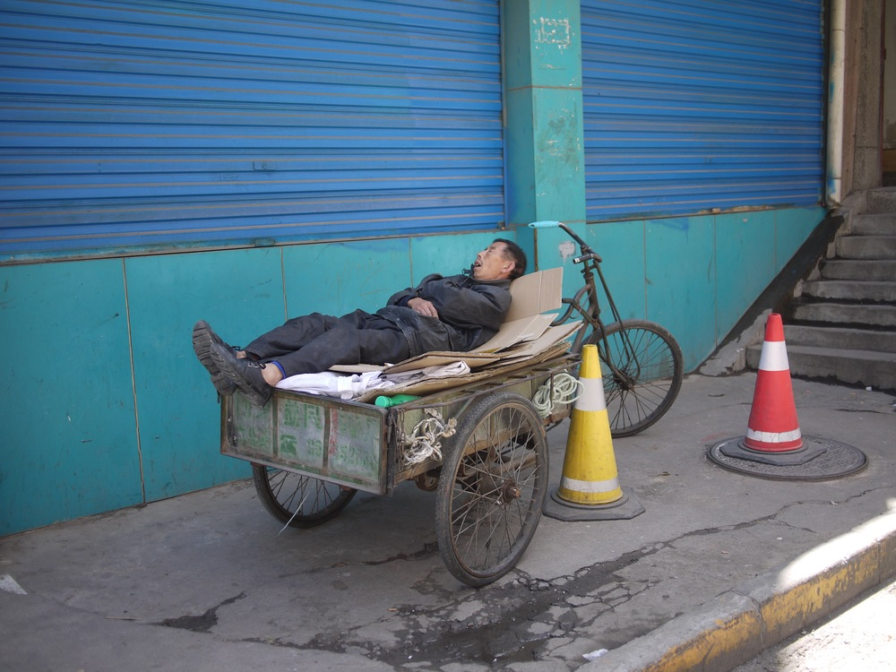

\[caption id="" align="alignnone" width="3024.0"\] Beijing Theatre \[/caption\]

It wasn't long ago that travelling on a trip longer than two weeks meant lumbering a laptop with you the whole way.

I've just recently returned from a four week trip travelling 5000 kilometres across the north of China, from Xi'an, through the dry rocky deserts, and finishing in Kashgar in western China.

All I had was my iPhone and iPad (with a keyboard). Obviously I didn't write any software but I could do pretty much everything else. If you can, travelling light can make a big impact on your daily stress level. Here are a few tips and tricks I learned while on the road.

\[caption id="" align="alignnone" width="4000.0"\] Afternoon nap in Xi'an \[/caption\]

# Cellular data

It's hard to underestimate how useful having good cellular data coverage is. With it, you can practically never get lost, and be your own tour guide at the same time by using apps like [Inquire](https://itunes.apple.com/gb/app/inquire-by-tamper/id1045268097?mt=8), which shows you Wikipedia articles about places close to your current location. I love the liberating feeling of just going where the path takes me instead of meticulously following a plan, and having cellular data gives me the confidence to just follow my feet and figure out where I am later.

## How to buy SIM cards

The best source of information about buying SIM cards internationally is on [WikiVoyage](https://wikivoyage.org). Each country's page on WikiVoyage will have a section discussing the cheapest and easiest ways to get a data SIM. You could also use a carrier like Three UK which gives free data roaming to several countries. You just need a little bit of pre-planning to make sure you get the right SIM, with the right coverage, when you land.

\[caption id="" align="alignnone" width="4000.0"\] Xi'an Bell Tower \[/caption\]

## Dealing with the Great Firewall

If you're travelling in China like I am, you'll find lots of the usual websites and services blocked or heavily throttled by the Great Firewall. Services such as Google, Dropbox, Twitter are all unusable over cellular or a WiFi connection. To get around this you'll need a VPN able to punch a hole through the firewall, without being caught by the sophisticated deep packet analysis that blocks the majority of VPN services.

I found [ExpressVPN](http://expressvpn.xyz/) to be reliable and easy to use on iOS, it bills every 30 days and uses a combination of UDP, TCP, and IPSec transports to get around present and future firewall restrictions.

If I had time, I would've setup [Streisand](https://github.com/jlund/streisand) on a VM at DigitalOcean instead, but ExpressVPN worked well enough.

The main problem is that using a constantly running VPN really hurts battery life, I probably got around half what I would normally expect to get, even with the excellent 4G reception in China. See the section below on charging and battery life to see ways to mitigate this.

# Charging and battery life

\[caption id="" align="alignnone" width="4000.0"\] Labrang Monastery  \[/caption\]

## Mobile power

When your phone or watch holds key information like your boarding pass, keeping all your devices charged up is more important than ever. I use an iPhone 6s, not a phone known for it's long battery life. Day-to-day I never usually worry about the battery running out, but when I'm travelling a typical day is often a lot longer, and a lot more strenuous on the phone's battery.

The simpliest solution if you just have a phone is to buy a charging case, I would get the [Apple Smart Battery Case](http://amzn.to/1Yz2PXg). It's integration with iOS, a design that avoids blocking antennas that would give attenuation, and the standard Lightning port for charging, make it the best overall case if you own an iPhone.

But like a lot of people, I have an increasing number of devices to keep charged, such as my Apple Watch, iPad, Bluetooth headphones, and my partner's phone and iPad as well.

So I use an external battery, and my preference goes to [Xiaomi's 10000mAh Power Bank](http://amzn.to/1UgKIjZ). I'll be honest, I like it best because its design reminds of of an oversized iPod mini, a nice aluminium shell with chamfered edges and four sexy LEDs indicating battery life. It's also one of the smallest batteries for its capacity. Paired with a short lightning and micro USB cables, it can easily keep every device I own charged up for at least two days without access to mains power.

## Mains power

For charging in hotels, I use an [Anker 5 port USB charger](http://amzn.to/1sMEyRP), capable of outputting 60W so I can charge two iPhones, two iPads, and the Xiaomi external battery all at full speed. Unfortunately my old Panasonic GF-1 camera can't be charged via USB, so that has it's own

All of this fits neatly into an [Ecosusi bag](http://amzn.to/1sMES2X), making it easy to pack away.

\[caption id="" align="alignnone" width="4095.0"\] Monk's dwellings at Labrang Monastery \[/caption\]

## Bags

I went with the recommendation from The Wirecutter for best carry-on luggage, going with the middle of the road [Travelpro Crew 10 suitcase](http://amzn.to/1OwPHQE). The quality of the materials, handle, and design all make it worth that extra over cheaper alternatives. This is not a suitcase you worry about breaking open, I even checked it in as hold luggage twice.

If you don't already, you should really use some [packing cubes](http://amzn.to/1UgK6ed), especially if you're going on a trip with a lot of different destinations so you don't want to unpack and repack at everyone.

Last but not least, because I like to travel light I don't feel the need for a backpack, so my day to day bag is the handsome [Billingham Hadley Pro](http://amzn.to/1sMHfTl), a shoulder bag designed for cameras but equally useful when travelling. I like the proper latch, which prevents oppurtunistic theives, but also has a quick release mechanism for easy access. I like the new Fibernyte material, which is like canvas but completely waterproof and requires no maintenence. The pockets inside and outside are plenty for a bag this size, and the padding means you can store cameras, iPhones, and iPads without worry. I would also recommend a [shoulder pad](http://amzn.to/1ScaCmS) as the strap is quite slippery, and to give a bit more comfort after carrying that for a long day.

\[caption id="" align="alignnone" width="4032.0"\] Oasis in the Gobi desert \[/caption\]

## Misc

*   Travelling with a partner? On really long trips I like to listen to audiobooks, and if you want to listen together a cheap [headphone splitter](http://amzn.to/1Ui67yE) is very useful.
    
*   Doing a lot of walking? A decent pair of shoes is essential, I did a fair amount of research before getting a pair of [Salomon Evasion](http://amzn.to/28OnnQt) walking shoes, and they're the best walking shoes I've ever bought. I walked 30km in a single day with these shoes without a blister.