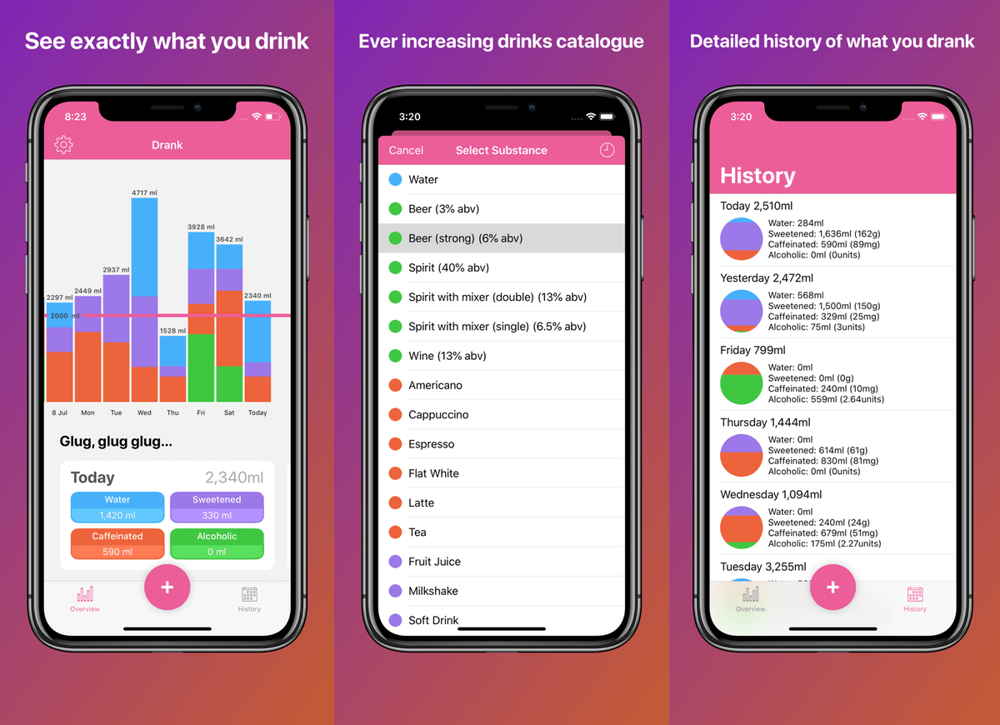

Most of my side projects are destined for obscurity, and not many even make it to the lofty heights where I would write a blog post about it. And that’s fine. I rarely start something with the ultimate aim of world domination, most come from an idea to scratch my own itch, and often my own satisfaction is enough.

But our itch this time is to improve what we drink, by having an easy way to track and visualise that data. And we’re scratching that itch with [Drank](https://thedrankapp.com). 

Not many side projects take over a year to get to 1.0, and Drank went through many iterations with internal testers before we found the right balance and feature set so ship an MVP. 

Together [with Eddie Lee](https://eddielee.me/introducing-drank), we believe we’ve shipped an app that helps us drink more water, and less caffeinated or sugary drinks. Being able to see a breakdown of my fluid intake over time has really encouraged me to have a glass of water over another cup of coffee in the afternoon.

But this is only the beginning for Drank, we have many more improvements and features in the backlog: ideas for even better visualisations, making it even easier to add drinks, and smarter notifications. And we are definitely looking at Siri integration with iOS 12.

[Follow me on Twitter](https://twitter.com/weiran), or [follow Drank](https://twitter.com/thedrankapp), to stay up to date as we develop it.