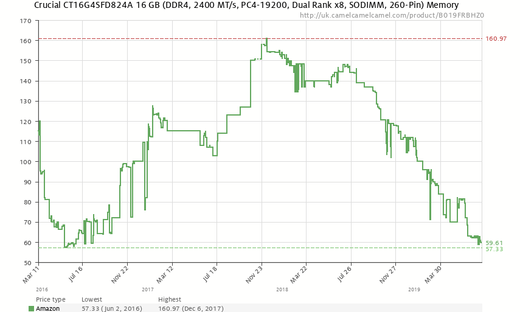
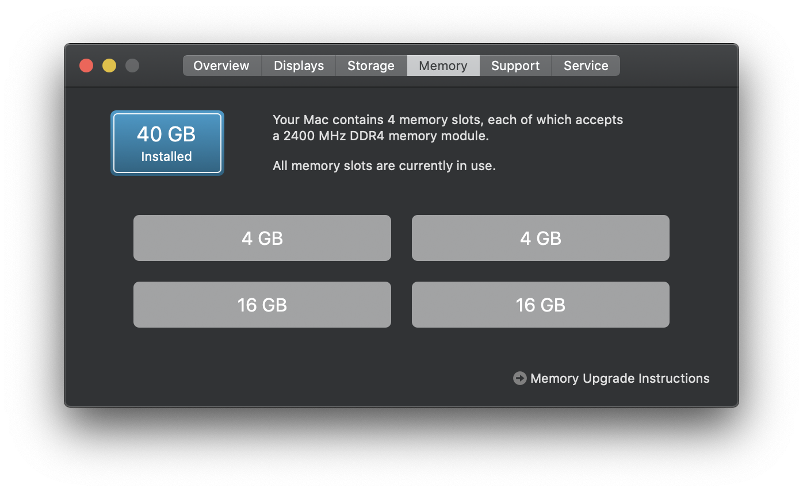
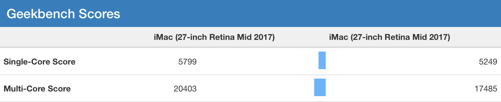

When I got my 27" iMac in 2017 it came with 8GB of RAM. Being one of the few Apple Macs with user upgradable RAM[^1], I decided to avoid that part of the Apple tax and buy my own. The stock 8GB came in two 4GB sticks to enable [dual channel memory](https://en.wikipedia.org/wiki/Multi-channel_memory_architecture). The iMac had 2 spare slots, so I ordered 16GB more as two 8GB sticks.

It was only when I opened the package that I realised I bought a [single 16GB stick](https://uk.crucial.com/gbr/en/ct16g4sfd824a) instead of two 8GB sticks. This would give the iMac three sticks RAM, which meant it couldn't use dual channel memory. 

Being impatient, instead of exchanging it for what I really wanted, I kept it and thought I would just buy another 16GB stick when the price is lower. 

###You don't know what you're missing

It turned out that for over 18 months RAM prices would remain above what I paid for my original 16GB stick. I didn't really use all of the 24GB of RAM I had, so I decided to keep on waiting. I never really felt like my iMac was slow[^2], and didn't think single channel memory would make much of difference. 

Recently that the price dropped to a point where it didn't feel like I was just burning money to satisfy a curiosity, 

So now I had dual channel memory again, is there any real difference? 

###You probably weren't missing much

I ran Geekbench 4 just before and after installing the final 16GB RAM stick, and I was surprised to see [over 10% increase](https://browser.geekbench.com/v4/cpu/compare/13872273?baseline=13858457) with dual channel memory. Single-core test resulted in **5,799** vs 5,249, and multi-core **20,403** vs 17,485. The [detailed results](https://browser.geekbench.com/v4/cpu/compare/13872273?baseline=13858457) show small increases across the tests, with memory bandwidth almost doubling. Certain multi-core tests had a big difference, probably ones which were being limited by the memory bandwidth rather than CPU performance. 

I also tried testing the time it took to do a clean full archive [of Hackers](https://github.com/weiran/Hackers), but it was only faster by one second[^3] with dual channel memory. Apart from playing games[^4], compiling swift is probably the most taxing thing I do on this Mac. Adding that new memory stick will make no noticable difference to that.

###Final words

Does dual channel memory make a difference? Only if you're doing something that is constrained by memory bandwidth. If you don't know if you're doing something that is memory bandwidth constrained, that means you probably aren't. I've spent £60 and gained nothing except a slightly better Geekbench score, but your mileage may vary.

[^1]: The others being the Mac mini and the new Mac Pro. You can upgrade the RAM in the iMac Pro but it involves [cutting sticky tap holding the display to the chassis](https://www.youtube.com/watch?v=_fBVy26FNbE) and a fairly lengthy disassemble process to get the motherboard out. I've done this before on an old 2011 iMac that needed GPU replacing, but I don't think I'd have the guts to do it on a brand new £5,000 iMac Pro.

[^2]: This is the 2017 model with the i7-7700K which for its time was an incredibly fast processor. Even now the single threaded performance is pretty good, and the iMac has the cooling to let it turbo boost to 4.4GHz pretty regularly. Although the noise the iMac's fans make when at full load is a different story.

[^3]: 34 vs 35 seconds with single channel memory. This is well within the margin of error as my timing methodology relied on using the iPhone's timer app. I think it also shows the synthetic nature of Geekbench, and doesn't always represent real world usage.

[^4]: I should've ran some gaming benchmarks before so I could do some comparisons, but my gut feeling is that most recent games are constrained by the Radeon Pro 580 GPU rather than the CPU or memory.