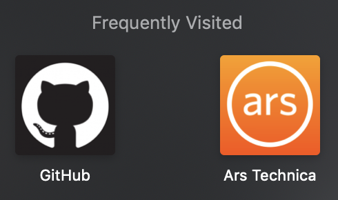
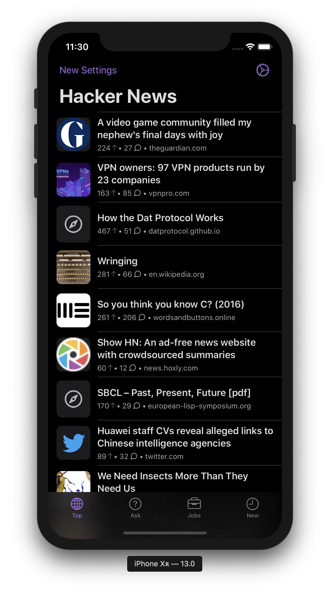

One of the biggest challenges in developing [Hackers](https://github.com/weiran/Hackers) is generating and fetching thumbnails for each post. The early versions didn't have a thumbnail, but scrolling through a long list of posts without a visual indicator meant it was really easy to lose your position. Adding a thumbnail image really helped with spatial awareness.

But neither the Hacker News API nor website have thumbnails for posts, only text links. I had to find another way.

### The Modern Prometheus

The first implementation in Hackers fetched each post body in the list. With the raw HTML, it would then scour the HTML for images that looked like they could be thumbnails. Once it found the one it wanted, it would then fetch the image, resize it, and display it in the cell. This would have to be done for each and every post in the list, of which 30 loaded at a time. Obviously this was incredibly slow, and taxing on your iPhone's CPU and data connection.

My algorithm for parsing HTML for images wasn't particularly efficient either, and in the days of the iPhone 5S and 6, the app would sometimes struggle to get 60 FPS scrolling, especially when the images it picked turned out to be large and the resizing would start to bottleneck.

There were some advantages to this approach, it was all done on the device so no server side component to host or manage. But the cost was probably too much work for a mobile device, and complex asynchronous code that would have to chain together multiple network requests, and a synchronous queue to conditionally update cells that could potentially (and probably likely) to have already gone off screen.

I never really liked this, but honestly felt too invested in [the monster I had created](https://en.wikipedia.org/wiki/Frankenstein) to let it go. I had several attempts at making it more efficient, introduction better local caching of thumbnails, and request cancellation if the cell disappeared off screen. But they didn't fix the fundamental problems with the approach, and just made the code even more complicated. It was time for a rethink.

### Orchestra

My second attempt would borrow from an old idea in Hackers. Even older versions of Hackers used an orchestration API I hosted on Heroku that converted the Hacker News website HTML into JSON response. I eventually moved this to in-app as the performance hit was negligible and [would enable authentication and voting features](log/2019/6/hackers-4) in the future.

However thumbnail fetching would be much easier if I created an API that took a URL as a parameter, and it did the fetching of the HTML body, parsing it, and returning a `301` redirect response to the image. This considerably reduced the work in-app, and made thumbnails faster and easier to fetch. A simple stateless API is much easier to scale on cloud infrastructure, so I created a [simple Node.js service](https://github.com/weiran/image-fetcher), and hosted on the [Zeit Now](https://zeit.co/now) platform on their free tier. I really felt much happier about this approach I'd offloaded the appropriate work to a server side component while still keeping the core functionality working in-app. I could also remove a whole heap of code that I was never liked and hated changing.

### Why haven't I thought of this before

But a pretty big problem still remained: the images it fetched were more often than not way too large to be a thumbnail and but I still had to download the whole image (sometimes several megabytes), and then resize and crop it into a thumbnail to display. 

I had a sudden realisation that our browsers now show high quality thumbnails, and not just the old 32x32 favicon. Through a combination of [Apple Touch Icon](https://mathiasbynens.be/notes/touch-icons) and [Open Graph](http://ogp.me), most web pages now have a high quality thumbnail embedded in their HTML response.



And of course, there are already [several](https://github.com/zongyz/get-website-favicon) [packages](https://github.com/meltwater/fetch-favicon) on npm that do just that. So Hackers now displays better thumbnail images that are much smaller in size, and the best part was I didn't even need to ship an update to Hackers to do it, it was just a change to the API.



### iOS 13 LinkPresentation

[Robbie Trencheny](https://twitter.com/robbie) [pointed me](https://github.com/weiran/Hackers/issues/115#issuecomment-501499108) to a new Apple framework quietly released at WWDC called [LinkPresentation](https://developer.apple.com/documentation/linkpresentation). The official documentation is sparse, but Apple released a [WWDC session video explaining the basics](https://developer.apple.com/videos/play/wwdc2019/262/).

This is the same framework that Messages.app uses to show link previews. [Swinjective-C has a good summary](https://www.swiftjectivec.com/linkpresentation-introduction/), but essentially everything is wrapped in `LPMetadataProvider` which does all the heavy lifting for you:

```
let metadataProvider = LPMetadataProvider()
metadataProvider.startFetchingMetadata(for: url) { (metadata, _) in
    if let metadata = metadata {

    }
}
```

Does this mean I can actually remove my custom thumbnail fetch from Hackers? I wanted to experiment so I created a branch for a proof of concept. In doing so I discovered that when you call `startFetchingMetadata`, it actually creates a `WKWebView` in the background to fetch and parse the whole URL. This adds a huge amount of overhead just to get a thumbnail, and is by far the most inefficient method I've tried in Hackers. `LPMetadata` conforms to `NSSecureCoding` so I added caching, but this only helped for subsequent requests. Just initiating around 10 requests at once for a single display's worth of thumbnails would grind the app to a halt. It doesn't help that you have to use `LPMetadataProvider` on the main thread, as its unable to instantiate a `WKWebView` on a background thread. 

Unfortunately while `LPMetadata` sounds good in theory, Apple's implementation is geared much more towards rich previews and not just fetching thumbnails. In its current state there's no way I can use it in Hackers.

### Final thoughts

While I'm happy with the current way of fetching thumbnails in Hackers, there is still a final optimisation I have in mind. The API is completely stateless, which means it has to fetch and parse every URL requested even if it has processed the same URL before. A simple cache or CDN in front of it could make it even faster. But first I want to focus on getting the iOS 13 update ready.