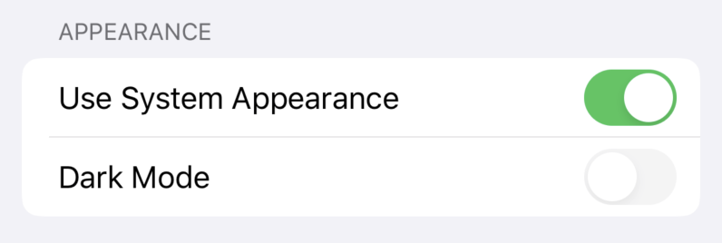

Today [Hackers 4.2](https://apps.apple.com/gb/app/hackers-for-hacker-news/id603503901) shipped to the iOS App Store. The headline feature is it can now automatically adapt to the device's system theme. 

Hackers originally gained dark mode in a May 2018 update [^1]. I don't think I could've picked a worse time to ship an app with its own custom theme system, because in June Apple announced at WWDC that iOS 13 would have native support for dark mode! Hackers now had a shiny new theme system that understood none of the new iOS 13 APIs, but still looked fine as long as you manually selected the right theme in Hackers to match iOS. This was *okay* but not great, however my motivation to refactor the theme system just after I shipped it was very low, and it's been that way ever since.

The beauty of working on an open source app is that I don't have to be the only one with motivation to get something done. Three months earlier [EkilDeew](https://github.com/EkilDeew) started working on adding a  setting to use the system theme which has led to us collaborating on overhauling the Hackers theme system to work with iOS 13 natively.

The simplicity of the UI and interaction shrouds the complexity of adapting Hackers' theme system for iOS 13. Themes are now defined in asset catalogues and native iOS UI will always match the picked theme. Hackers will respond to system theme changes, so if you let iOS automatically change theme depending on the time of day, Hackers will also change. 

It's a great feeling to pay off technical debt while developing a new feature, and especially great it was done with the generosity of individual contributors to the open source community. These are the types of releases that really help keep my motivation to continue working on this project even though it's feature complete for my purposes.

Checkout the [issues](https://github.com/weiran/Hackers/issues) and [milestones](https://github.com/weiran/Hackers/milestones) on GitHub to see what's coming up next.

[Download Hackers from the App Store](https://apps.apple.com/gb/app/hackers-for-hacker-news/id603503901).

---

[^1]: This is not the entire truth. Early versions of Hackers also had a dark theme, however this feature was lost when the app had it's big Swift rewrite in 2016.