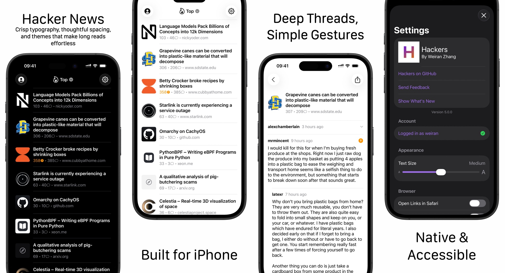

I just shipped the biggest update to [Hackers](https://github.com/weiran/Hackers) since 4.0: version 5.0. And unlike previous updates which were mostly about adding features, this one is a complete rewrite from the ground up.

When I shipped 4.0 back in 2019, I wrote "Here's to the next six years." Well, it's been six years, and honestly I didn't expect to be doing another complete rewrite so soon. But here we are.

## Why rewrite again?

The short answer is Storyboards. If you've ever maintained an iOS app with Interface Builder and Storyboards, you know the pain. What starts as a nice visual way to lay out your app quickly becomes a nightmare when you're dealing with merge conflicts in XML files, or when Xcode decides to corrupt your storyboard for no apparent reason.

But the deeper issue was that Storyboards made it hard to evolve with iOS. It wasn't screen sizes per se; it was the shifting size classes, interface idioms, and interaction patterns, plus new accessibility requirements. What should have been simple updates became archaeology missions through brittle scene graphs—especially as the ecosystem has largely moved to SwiftUI.

By 2024, I was spending more time fighting the architecture than actually improving the app. Version 4.9.3 was stable and worked well, but I couldn't shake the feeling that I was maintaining a house of cards.

And as an open‑source project, a Storyboard‑based codebase basically stopped attracting contributors—most folks now expect to work in SwiftUI.

## What actually changed

The numbers tell part of the story: I removed 3,357 lines of UIKit code (including `Main.storyboard`), restructured everything into 9 Swift Package Manager modules, replaced PromiseKit with native async/await, and added 245 tests using the new Swift Testing framework.

On the surface, the app adopts iOS 26's new Liquid Glass design and feels snappier throughout. There’s also a new text size control for in‑app font scaling.

But the real difference is qualitative. Adding new features is straightforward instead of surgical, and the codebase is something I actually want to work in again.

## The AI bit

I used 5.0 as a deliberate exercise in tool‑assisted AI development.

Claude Code and OpenAI Codex assisted most of the rewrite: they helped shape the clean architecture, sped up refactors, rebuilt many Storyboard views in SwiftUI, and wrote most of the tests.

I started by approving every change in the terminal. This quickly got tedious and felt slower than writing it myself. The better approach was to feed agents rich context and give them autonomy, instead of micromanaging them step-by-step. AKA yolo mode.

When output missed the mark, I tightened the prompt or context and re‑ran the task. The models are then really good at updating your `AGENTS.md` file to learn from the "mistake". Pairing models and running agents in parallel to cross‑check plans and diffs made each loop even more reliable.

The code isn’t perfect, and it’s not exactly how I’d hand‑write it, but the pace was night‑and‑day—shipped in under a month.

I'll probably write another post on this topic.

## What I learned

This rewrite reinforced a few things. First, modular architecture compounds: clear module boundaries make the codebase better and give agents a much higher chance of one‑shotting a prompt to a good standard.

Second, don’t fight platform evolution. I spent years trying to make Storyboards work instead of admitting they weren’t the right tool anymore.

Third, AI‑assisted development is genuinely transformative—especially for a niche open‑source app like Hackers. The speed and ease of shipping lowers the barrier for contributors and hopefully accelerates the pace of future improvements and features.

## Looking ahead

Hackers has been around for 12 years now, and it's still one of the top iOS Hacker News apps. That happened through what I called "persistence since 2013" - just keeping at it, updating regularly, making each interaction a bit slicker with every release.

Thanks to all the users, testers, and contributors who have helped keep this app going for 12 years.

This rewrite sets up the app for whatever comes next. The modular architecture means I can experiment with new features without breaking everything. And I already have a few ideas brewing.

*Hackers 5.0 is [available now on the App Store](https://apps.apple.com/app/hackers/id603503901). The source code is on [GitHub](https://github.com/weiran/Hackers) if you want to see how it all works.*
