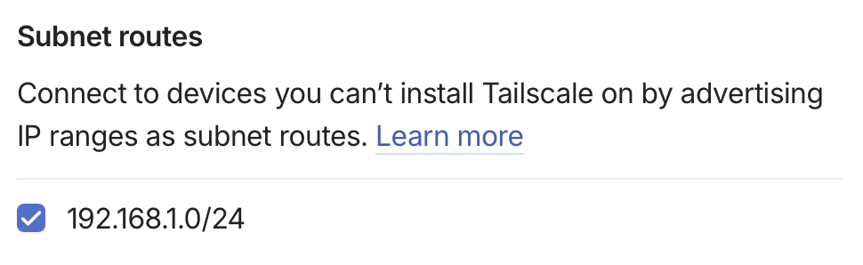
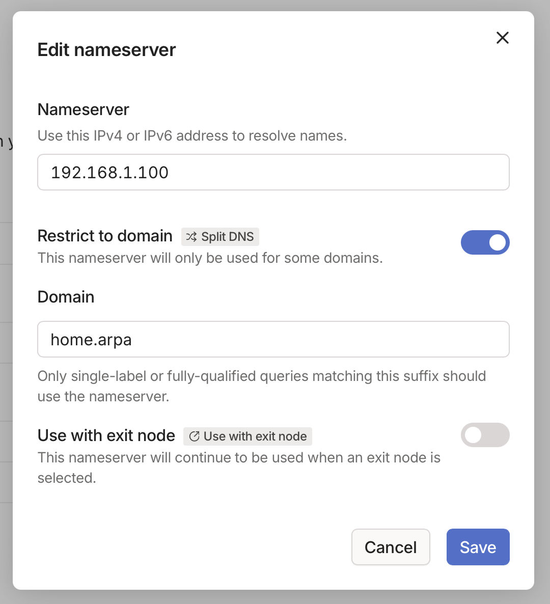

A while back I opened my laptop to tick off a handful of routine chores: find a recipe, work on my tax return, skim the budget, pretty normal day-to-day stuff. Five tabs later I’d been upsold on a “new pro plan,” nudged to accept fresh data-sharing terms I didn’t ask for, and informed that my subscription cost is going up in April by 8%. That's when it hit me that I’m renting the everyday parts of my life from companies that can rewrite the deal whenever they want.

That frustration is what led to self-hosting. I want the convenience of the public web—friendly URLs and access from anywhere, without ceding custody of my data or paying subscription creep forever. A private cloud gave me that mix of control and polish: the services feel public, but they live solely on a network and physical server that I own. The hardware is modest, the power draw tiny, and the result is freedom and control of your own data, while keeping it off the lecherous gaze of other people.

My first stabs at a “private cloud” fizzled because they were a pain to reach out of my home network. Everything lived on `.local` hostnames, I’d hop onto a VPN, and then watch those names silently fail because mDNS doesn’t cross tunnels and Tailscale quite sensibly refuses to resolve them. Half the time I had to use random port numbers to differentiate between apps. That took the sheen off It finally clicked that I needed to treat my homelab like the public internet—assign real DNS, pick routable names, and make them work identically on Wi-Fi or through a tailnet.

This post is the recipe I ended up with: one set of friendly URLs for my services that works on at home and on public Wi-Fi, without dangerously exposing anything to the internet. You’ll type something like `https://bookmarks.home.arpa` and it will just work, whether you’re at home or connected with a VPN.

---

## The objective: one name for all

Give everything a real name, let your LAN’s DNS resolve those names to your server, and use a private VPN (Tailscale) so those same names resolve from anywhere you are. A reverse proxy on your server receives the requests and hands them to the right services. To you it feels like the public web; to everyone else it’s invisible.

---

## Pick a private home for your names

`.local` sounds cute and I used it for years, but it is guaranteed to cause trouble because it belongs to mDNS. `home.arpa` is [designated for use in residential home networks](https://datatracker.ietf.org/doc/html/rfc8375) and recommended to avoid leaking your DNS queries to third parties.

On the network side you need a DNS server. That sounds hard but [Pi-hole](https://pi-hole.net) does a fine job of being a DNS server, and you probably already have it blocks ads anyway. The trick is to make Pi-hole *authoritative* for your private suffix so it answers from home instead of asking the wider world.

Two lines do the heavy lifting:

```
local=/home.arpa/
address=/home.arpa/192.168.1.100 # Your server's IP
```

`local=/…/` tells dnsmasq (the resolver inside Pi-hole) that the zone is local and must not be forwarded upstream. `address=/…/IP` is a wildcard that maps anything under `home.arpa` to your NAS’s LAN IP. 

One Pi-hole gotcha is with v6, by default it doesn’t load `/etc/dnsmasq.d`. Flip the switch in **Settings → All settings → Miscellaneous**: “Load additional dnsmasq configs from `/etc/dnsmasq.d`”. Point your router’s **DHCP DNS** at the Pi-hole IP so everything on the network actually uses it.

Now at home you can visit `http://app.home.arpa` and you’ll hit your server. We’ll tidy up HTTPS and hostnames next.

---

## Put a front door on everything

If you’re running multiple services on a single host, you have them listening on random ports. That gets old. A reverse proxy lets you stop remembering ports and start using names.

I use a Synology NAS which has a built-in reverse proxy, which is just a thin wrapper around `nginx`. Add an entry like:

- **Source:** `app.home.arpa` on 80  
- **Destination:** `http://127.0.0.1:8000` (or wherever port your app lives)

Do the same for any other services you’re running. The proxy routes by Host header, so one IP can front as many services as you like.

---

## TLS for private names

Public certificate authorities won’t issue certificates for `home.arpa`. You have two solid options:

**Use a small private CA.**  
The quick path is `mkcert`: install its root once on your devices, then generate a wildcard cert for `*.home.arpa` and import it into Synology’s certificate store. If you prefer automation, run `step-ca` as your own ACME server and let a client auto-renew. Either way, the browser gets a padlock and you stay off the public web.

**Use a real domain you own.**  
If you have `example.com`, you can issue `*.home.example.com` via a DNS-01 challenge with Let’s Encrypt even if those names don’t resolve publicly. Keep the records split so they only exist to your LAN and your tailnet. The advantage is zero device trust fiddling; the trade-off is owning a domain and wiring the DNS-01 bit once.

Whether you think this level of transport security is needed is your own decision to make. Personally I didn't bother as I'm either accessing these servers on my private network or via a secure Tailscale tunnel, but your use case it might be worth it. If so, I'd probably just buy a real domain so Let's Encrypt can issue certificates.

---

## Make those same names work when you’re away

This is where Tailscale earns its keep. The goal is simple: keep using `app.home.arpa` on public Wi-Fi without opening your house to the internet.

Install Tailscale on the NAS and advertise your LAN subnet—say, `192.168.1.0/24`. This allows all your tailnet devices to reach `192.168.1.1` as if they were at home. Then add a split-DNS rule (Tailscale calls these **restricted nameservers**): send queries for `home.arpa` to your Pi-hole IP on the LAN. MagicDNS can stay on; the restricted rule is what steers those names to the right place.

From that point on, your laptop or phone does the same thing in both places:

1. Look up `apps.home.arpa`.  
2. Get `192.168.1.100` from Pi-hole (locally, or via the tailnet).  
3. Connect over the tailnet if you’re away, directly if you’re home.  
4. Land at the reverse proxy, which forwards you to the right container.

To your browser it feels indistinguishable from a public website. To the internet at large, your services don’t exist.

---

## Putting it together

It took me a couple hours to figure this out, but it boils down to a few steps:

1. Choose a private suffix like `home.arpa`.  
2. In Pi-hole v6, enable loading `/etc/dnsmasq.d`, then add:
   ```ini
   local=/home.arpa/
   address=/home.arpa/192.168.1.100 # Your server's IP
   ```
   Restart Pi-hole and make sure your router’s DHCP points clients at it.
3. Configure the reverse proxy so `bookmarks.home.arpa` routes to your bookmarker, `budget.home.nas` to your budgeting app, and so on. I just used the included reverse proxy with Synology.
4. Install Tailscale on the NAS, advertise the `192.168.1.0/24` route, approve it, and add a restricted nameserver mapping `home.arpa` to the Pi-hole IP. Connect your devices to your tailnet.




---

## Et voila

